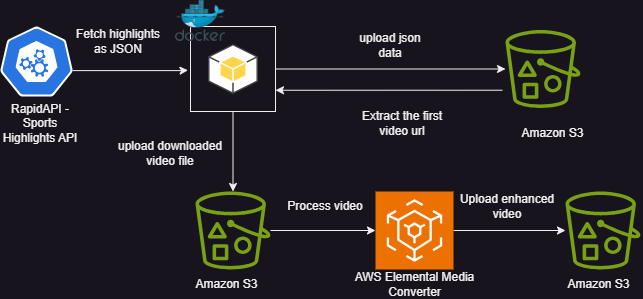

# GAME HIGHLIGHT PROCESSOR
This project uses RapidAPI to obtain NCAA game highlights using a Docker container and uses AWS Media Convert to convert the media file.

## Technical Diagram



## File Overview

### Dockerfile
Create a file called Dockerfile and copy the code in [a relative link](./Dockerfile)
This code creates a docker image that will be used to run the game highlight processor. 
- It uses a lightweight version of python as the base image.
- Then it sets the working directory to /app.
- Then it copies the requirements.txt file(which stores dependencies) to the container then runs the file to install the dependencies.
- Then copies all python scripts to the container('.' means the current directory).
- It installs the AWS CLI inside the container to allow interactions with services like media convert.
- Runs the run_all.py when the container runs. This file automates the running of the other scripts.

### config.py
This file stores variables which read the environment variables.

### fetch.py
- The `fetch_highlights()` function fetches highlight data from the API as JSON.
- The the `save_to_s3()` function saved to data to an S3 bucket.
- process_highlights() calls the `fetch_highlights()` and `save_to_s3()` functions to fetch and save the data.

### process_one_video.py
retrieves the JSON file from the s3 bucket, extracts the video url from the JSON and saved to video itself to S3.
input_key - path to where the json file is saved
output-key - path to where the output video file will be saved

### mediaconvert_process.py
`create_job()` initializes the AWS mediaconvert client 
Creates and submits a MediaConvert job Uses MediaConvert to process a video file - configures the video codec, resolution and bitrate. Also configured the audio settings Stores the processed video back into an S3 bucket.

### run_all.py
Runs all three scripts in chronological order: fetch.py, process_one_video.py, mediaconvert_process.py

## Prerequisites

### Create a RapidAPI account and get an API key.
This is the api with which we will be accessing highlight images and videos.
For this example we will be using NCAA (USA College Basketball) highlights since it's included for free in the basic plan.

### Installation
Have docker, aws cli, and python3 installed.

### Information needed
Retreive AWS account ID, access keys and secret keys from the AWS Console
Account ID: Click on your account name in the top right corner You will see your account ID Copy and save this somewhere safe
Access and secret keys: In the IAM dashboard, under Users, click on a user and then "Security Credentials" Scroll down until you see the Access Key section You will not be able to retrieve your secret access key so if you don't have that somewhere, you need to create an access key

# START HERE - Local
## **Step 1: Clone The Repo**
```bash
git clone https://github.com/AdemiluaIbukunoluwa/game-highlight-processor.git
cd src
```
## **Step 2: Add API Key to AWS Secrets Manager**
```bash
aws secretsmanager create-secret \
    --name my-api-key \
    --description "API key for accessing the Sport Highlights API" \
    --secret-string '{"api_key":"YOUR_ACTUAL_API_KEY"}' \
    --region us-east-1
```
## **Step 3: Create an IAM role or user**

In the search bar type "IAM" 

Click Roles -> Create Role

For the Use Case enter "S3" and click next

Under Add Permission search for AmazonS3FullAccess, MediaConvertFullAccess and AmazonEC2ContainerRegistryFullAccess and click next

Under Role Details, enter "HighlightProcessorRole" as the name

Select Create Role

Find the role in the list and click on it
Under Trust relationships
Edit the trust policy to this:
Edit the Trust Policy and replace it with this:
```bash
{
  "Version": "2012-10-17",
  "Statement": [
    {
      "Effect": "Allow",
      "Principal": {
        "Service": [
          "ec2.amazonaws.com",
          "ecs-tasks.amazonaws.com",
          "mediaconvert.amazonaws.com"
        ],
        "AWS": "arn:aws:iam::<"your-account-id">:user/<"your-iam-user">"
      },
      "Action": "sts:AssumeRole"
    }
  ]
}
```

## **Step 4: Update .env file**

1. RapidAPI_KEY: Ensure that you have successfully created the account and select "Subscribe To Test" in the top left of the Sports Highlights API
2. AWS_ACCESS_KEY_ID=your_aws_access_key_id_here
3. AWS_SECRET_ACCESS_KEY=your_aws_secret_access_key_here
4. S3_BUCKET_NAME=your_S3_bucket_name_here
5. MEDIACONVERT_ENDPOINT=https://your_mediaconvert_endpoint_here.amazonaws.com
```bash
aws mediaconvert describe-endpoints
```
7. MEDIACONVERT_ROLE_ARN=arn:aws:iam::your_account_id:role/HighlightProcessorRole

## **Step 5: Secure .env file**
```bash
chmod 600 .env
```
## **Step 6: Locally Buikd & Run The Docker Container**
Run:
```bash
docker build -t highlight-processor .
```

Run the Docker Container Locally:
```bash
docker run --env-file .env highlight-processor
```
           
This will run fetch.py, process_one_video.py and mediaconvert_process.py and the following files should be saved in your S3 bucket:

Optional - Confirm there is a video uploaded to s3://<your-bucket-name>/videos/first_video.mp4

Optional - Confirm there is a video uploaded to s3://<your-bucket-name>/processed_videos/

### **What We Learned**
1. Working with Docker and AWS Services
2. Identity Access Management (IAM) and least privilege
3. How to enhance media quality 

### **Future Enhancements**
1. Using Terraform to enhance the Infrastructure as Code (IaC)
2. Increasing the amount of videos process and converted with AWS Media Convert
3. Change the date from static (specific point in time) to dyanmic (now, last 30 days from today's date,etc)
